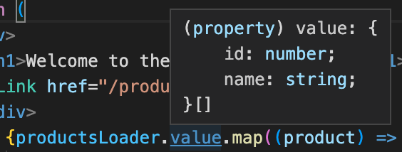

# Qwik Rabbit Store Tutorial

<!-- TODO: Put large code blocks in these things -->
<!-- <details>
  <summary>
  Code
  </summary>

  ```bash
   mkdir foo
  ```
</details> -->

## Introduction

So, you've caught the buzz about how blazingly fast and performant Qwik is, and you want to take this supposedly amazing new framework out for a test drive.

> Haven't caught the buzz yet? You might want to give [this a qwik read](https://www.builder.io/blog/the-qase-for-qwik-love-at-first-tti).

Fortunately, Qwik is really easy to pick up. You can get productive with Qwik in the time it takes to complete this tutorial.

Ready to learn Qwik? Excellent! Let's build a store.

We're going to start with something very simple, then we'll start adding features with the explicit goal of _trying_ to make it slow. We'll check the PageSpeed scores regularly as we add features. Spoiler: Although we'll try really, really hard to sabotage our store's performance by adding bells and whstiles, we're going to fail at this. The finished store will be about as fast and performant as our simple starting point. This is what we mean by, "Get performance for free."

A store makes an excellent example app for Qwik because it has tons of interactivity, has to load instantly, has to be interactive instantly and has to respond to user interactions instantly. Qwik excels at "instantly", as we'll see.

This tutorial will walk you through every step of building a store app with perfect PageSpeed scores without having to spend a lot of time thinking about performance. Your time is precious. Let Qwik handle performance for you so you can focus on building your app!

Our store has to sell something. We're going to build a store that caters to rabbits. The Qwik Rabbit Store: Where rabbits come to shop. Along the way, you'll learn how Qwik handles routing, data access, components and much more. You'll see how easy it is to pick up Qwik and start getting outstanding performance for free.

## Prerequisites

To get the most out of this witty and scintillating tutorial, you'll want to be at least conversant in Typescript, and have at least a passing familiarity with the command line.

As you follow along, you can code up the store in StackBlitz, if that's how you roll. Otherwise, you'll need to have the following installed:

- Node.js v16 or higher
- npm 7 or fresher
- Your favorite IDE (vscode recommended)

## Create a New Qwik Project

To get started, pop open a terminal and:

```bash
npm create qwik@latest
```

<!-- TODO: Or yarn or pnpm -->

You'll be prompted for a few details. Answer with:

```bash
? Where would you like to create your new project? › ./qwik-rabbit-store

? Select a starter › (use ↓↑ arrows, hit enter)
❯   Basic App (QwikCity) - └─App with Routing built-in (recommended)
? Would you like to install npm dependencies? › (Y)
```

And you'll see this output:

```bash
🦄 Success!  Project created in qwik-rabbit-store directory

🐰 Next steps:
   cd qwik-rabbit-store
   npm start

💬 Questions? Start the conversation at:
   https://qwik.builder.io/chat
   https://twitter.com/QwikDev

📺 Presentations, Podcasts and Videos:
   https://qwik.builder.io/media/
```

> ### What we just generated
>
> The Qwik project has a very full-featured server-side framework for Qwik apps called QwikCity. QwikCity is to Qwik, what [Next.js](https://nextjs.org/) is to React, what [Nuxt](https://nuxtjs.org/) is to Vue, or [SvelteKit](https://kit.svelte.dev/) to Svelte. We just generated a complete QwikCity starter project.
>
> For the sake of simplicity, we'll just refer to the whole thing as Qwik in this tutorial.

## Open in IDE

Now, open the newly created `qwik-rabbit-store` directory in your IDE. It should look like this:


_Our project opened in VS Code with terminal open_

## Let's Clean!

Before we start coding, let's clean out some stuff from the generated project that we don't need for our store.

Run this in your terminal:

```bash
rm -rf src/components/header src/components/icons src/routes/flower src/routes/todolist src/routes/layout.tsx
```

Next, open `src/global.css` and delete it's contents. **Don't delete the file, though!** We'll need it later.

Finally, open `src/routes/index.tsx` and replace it's contents with:

```tsx
import { component$ } from "@builder.io/qwik";
import type { DocumentHead } from "@builder.io/qwik-city";

export default component$(() => {
  return (
    <div>
      <h1>Welcome to the Qwik Rabbit Store</h1>
    </div>
  );
});

export const head: DocumentHead = {
  title: "Qwik Rabbit Store",
  meta: [
    {
      name: "description",
      content: "The Qwik Rabbit Store: Where rabbits go to shop",
    },
  ],
};
```

Just to make sure everything's working, start up the dev server by running the following in your terminal:

<!-- TODO: Or yarn or pnpm -->

```bash
npm run dev
```

You'll see output in the terminal similar to:

```bash
  VITE v4.1.1  ready in 2055 ms

  ➜  Local:   http://localhost:5173/
  ➜  Network: use --host to expose
  ➜  press h to show help
```

Now, point your browser at [http://localhost:5173/](http://localhost:5173/), and you'll see:


_Our nascent Home page_

## Deployment

## Routing in Qwik

Qwik uses file-based routing. All code files that implement routes live under the `src/routes` directory, and its subdirectories.

The `src/routes/index.tsx` file implements our Home page route. Let's take a look inside this file. Open it in your IDE. You'll see the following code:

```tsx
import { component$ } from "@builder.io/qwik";
import type { DocumentHead } from "@builder.io/qwik-city";

export default component$(() => {
  return (
    <div>
      <h1>Welcome to the Qwik Rabbit Store</h1>
    </div>
  );
});

export const head: DocumentHead = {
  title: "Qwik Rabbit Store",
  meta: [
    {
      name: "description",
      content: "The Qwik Rabbit Store: Where rabbits go to shop",
    },
  ],
};
```

This is a typical Qwik route file. Notice the default export. Each route file exports a component by default, and this components is what gets rendered when a user visits the route in the browser.

> We'll have much more to say about Qwik components and the `component$` function in a bit.

The `head: DocumentHead` export configures stuff that goes in the `<head/>` of the rendered page (like the page title and meta data).

In Qwik, routes map to page URLs, like so:

<table>
  <tr>
    <th>File path</th>
    <th>URL path</th>
  </tr>
  <tr>
    <td>`src/routes/index.tsx`</td>
    <td>/</td>
  </tr>
  <tr>
    <td>`src/routes/foo/index.tsx`</td>
    <td>/foo</td>
  </tr>
</table>

Let's create a new route. Since we're building a store, we're going to need a Products page. Create a new `products` directory with:

```bash
mkdir src/routes/products
```

And create an empty route file in the new directory with:

```bash
touch src/routes/products/index.tsx
```

Now, open the newly created `src/routes/index.tsx` file in your editor, and add the following contents:

```tsx
import { component$ } from "@builder.io/qwik";
import type { DocumentHead } from "@builder.io/qwik-city";

export default component$(() => {
  return (
    <div>
      <h1>Products will appear here remarkably soon</h1>
    </div>
  );
});

export const head: DocumentHead = {
  title: "Qwik Rabbit Store :: Products",
  meta: [
    {
      name: "description",
      content: "The Qwik Rabbit Store: Products",
    },
  ],
};
```

Point your browser at [http://localhost:5173/products/](http://localhost:5173/products/) to see the result:


_Our Products page_

See how that works? The directory name, `products`, determines the URL path, and the `index.tsx` file inside the directory implements the route.

You can put other files inside our `products` directory, like CSS files and component files related to the products route. But, only the `index.tsx` file will be served as a route.

> Routes in Qwik can also capture params, like `/products/123` or `/products?id=123`. More on this in a bit.

## Links

Now that we have a Home page route and a Products page route, let's create links so our customers can navigate between them.

Open the Home page route file, `/src/routes/index.tsx`, and paste the following in underneath `<h1>Welcome to the Qwik Rabbit Store</h1>`:

```tsx
<a href="/products">Products</a>
```

Let's also add a link back to the home page to our Products page. Open `/src/routes/products/index.tsx`, and paste in:

```tsx
<a href="/">Home</a>
```

Now, head back over to your browser to see the result:


_Home page with link to Products page_

Click on the link to navigate to the Products page:


Go ahead and click on it (I know you want to). Now, try navigating back and forth between the two pages, and notice that each click results in a full page refresh. If we want SPA-like behavior (navigation without a page refresh), we can use Qwik's `<Link />` component instead. Here's what that looks like:

<!-- TODO: I'm actually using <a>s -->

```tsx
<Link href="/products">Products</Link>
```

And:

```tsx
<Link href="/">Home</Link>
```

> Also be sure and import the Link component with:
> import { Link } from "@builder.io/qwik-city";

In the Home page and Products page, go ahead and replace the `<a/>`s with `<Link>`s and do some clicking. The links look the same, but there's no page refresh. This is nice when we want to retain the state of the app when the user navigates. Let's use `<Links />`s here.

> You might be tempted to always use `<Link />`s rather than `<a/>`s for performance. With Qwik, page loads are so incredibly fast (since they contain almost no JavaScript) that the preformance benefit is negligible in many cases. Experiment a bit, and see what you think.

## CSS

Let's get some style into out store. Qwik makes it easy to use whatever CSS solution you prefer. For this tutorial, we're going to use Tailwind because it's familiar to most developers.

In your terminal, run:

```bash
npx qwik add
```

You'll see a list of choices that looks like this:

```bash
🦋  Add Integration

? What integration would you like to add? › (use ↓↑ arrows, hit enter)
❯   Adaptor: Cloudflare Pages
    Adaptor: Netlify Edge
    Adaptor: Vercel Edge
    Adaptor: Nodejs Express Server
    Adaptor: Static site (.html files)
    Framework: React
    Integration: Playwright (E2E Test)
    Integration: Styled-Vanilla-Extract (styling)
    Integration: Tailwind (styling)
    Integration: Partytown (3rd-party scripts)
```

Use the up/down arrow keys to select `Integration: Tailwind (styling)`, and hit enter. You'll see:

```bash
👻  Ready?  Add tailwind to your app?

🐬 Modify
   - package.json

🌟 Create
   - .vscode/settings.json
   - postcss.config.js
   - tailwind.config.js

💾 Install npm dependencies:
   - postcss ^8.4.16
   - tailwindcss ^3.1.8
   - autoprefixer 10.4.11

? Ready to apply the tailwind updates to your app? ›
❯   Yes looks good, finish update!
    Nope, cancel update
```

Hit enter to install Tailwind. When it completes, you'll see:

```bash
✔ Updating app and installing dependencies...
🦄  Success!  Added tailwind to your app

📚 Relevant docs:
   https://qwik.builder.io/qwikcity/integrations/tailwind/
   https://tailwindcss.com/docs/utility-first

💬 Questions? Start the conversation at:
   https://qwik.builder.io/chat
   https://twitter.com/QwikDev

🟣  Action Required!
   ------------------------------------------------
   You must add the next lines into global.css file
   global.css -------------------------------------

   @tailwind base;
   @tailwind components;
   @tailwind utilities;
```

Notice where it says `Action Required!` Copy the three `@tailwind` directives, then open your `src/global.css` file, and paste them in.

```css
@tailwind base;
@tailwind components;
@tailwind utilities;
```

We can now use Tailwind CSS anywhere in our application, and it will just work. Cool!

Tailwind has some handy plugins that we'll be using for forms, typography and controlling aspect ratio. Let's install those:

```bash
npm install @tailwindcss/typography @tailwindcss/forms @tailwindcss/aspect-ratio
```

We also need to let Tailwind know about these plugins. Open the `tailwind.config.js` in your project root directory, and (where it says "plugins") add the plugins:

```js
plugins: [
  require("@tailwindcss/typography"),
  require("@tailwindcss/forms"),
  require("@tailwindcss/aspect-ratio"),
];
```

To complete our CSS setup, we'll add a few styles to our `global.css`. Open `src/global.css`. At the bottom, add:

```css
b {
  font-weight: unset;
  display: block;
}
s {
  text-decoration: unset;
}

@layer base {
  [type="text"]:focus,
  [type="email"]:focus,
  [type="url"]:focus,
  [type="password"]:focus,
  [type="number"]:focus,
  [type="date"]:focus,
  [type="datetime-local"]:focus,
  [type="month"]:focus,
  [type="search"]:focus,
  [type="tel"]:focus,
  [type="time"]:focus,
  [type="week"]:focus,
  [multiple]:focus,
  textarea:focus,
  select:focus {
    --tw-ring-color: #7e23ce;
    border-color: var(--tw-ring-color);
    @apply transition;
  }

  input:-webkit-autofill,
  input:-webkit-autofill:focus {
    transition: background-color 600000s 0s, color 600000s 0s;
  }

  a,
  [type="checkbox"],
  [type="radio"] {
    color: #7e23ce;
    @apply transition;
  }

  [type="checkbox"]:focus,
  [type="radio"]:focus {
    --tw-ring-color: #7e23ce;
    @apply transition;
  }

  button:focus,
  a:focus {
    box-shadow: 0 0 0 1px #7e23ce;
    border-color: #7e23ce;
    outline: none;
    @apply transition;
  }
}
```

> Note: You can add any arbitrary CSS you like to `global.css`, and it will be available througout the application.

Finally, open your `src/root.tsx` file and add a class attribute to the `<body/>` element so that it looks like this:

```jsx
<body
  class="text-gray-900 transition dark:bg-gray-900 dark:text-gray-300"
  lang="en"
>
```

## Layouts

We'd like the pages of our store to have a common appearance. Let's create a common header and footer that we can use throughout the site. We'll do this using a layout.

Create a new file called `layout.tsx` in `src/routes`:

```bash
touch src/routes/layout.tsx
```

Now, open the newly created `layout.tsx` file in your IDE, and paste in the following contents:

```tsx
import { component$, Slot } from "@builder.io/qwik";

export default component$(() => {
  return (
    <div>
      <header>Header</header>
      <main>
        <Slot />
      </main>
      <footer>Footer</footer>
    </div>
  );
});
```

> Notice the `<Slot />` component. This is where the page content for each of your routes will go. We'll have more to say about slots in a bit.

Back in your browser, you'll see:


Click the `Products` page link to see that our new layout applies to both of our pages.

> Note: Each route in a Qwik application can also have its own page-specific layout. More on this in a bit.

## Components

Our header and footer decompose nicely into components. So, let's create those.

We're going to need a logo icon for the header. Let's first create a reusable `<LogoIcon />` component.

In your terminal, run:

```bash
mkdir src/components/icons; touch src/components/icons/logo-icon.tsx
```

Now, open your newly created `logo-icon.tsx` and add the following code:

```tsx
import { component$ } from "@builder.io/qwik";

interface LogoProps {
  color?: string;
  width?: string;
  height?: string;
}

export default component$(
  ({
    color = "text-gray-700",
    width = "h-8",
    height = "w-auto",
  }: LogoProps) => {
    return (
      <svg
        class={`block ${color} ${height} ${width}`}
        width="60"
        height="60"
        viewBox="0 0 60 60"
        fill="none"
        xmlns="http://www.w3.org/2000/svg"
      >
        <rect y="0.5" width="60" height="60" rx="30" fill="currentColor" />
        <path
          d="M33.7871 26.5682C33.6987 24.4925 33.6545 23.4547 33.7877 22.4298C33.921 21.4048 34.229 20.4128 34.8452 18.4288L37.2355 10.7318C37.7301 9.13914 37.9774 8.34283 38.3717 8.3697C38.766 8.39657 38.903 9.21907 39.177 10.8641L40.3491 17.9024C40.7476 20.2952 40.9469 21.4916 40.9046 22.6955C40.8624 23.8995 40.5797 25.079 40.0144 27.4379L34.7584 49.3718L33.7871 26.5682Z"
          fill="#F9F9F9"
        />
        <path
          d="M26.1662 26.5682C26.2546 24.4925 26.2988 23.4547 26.1655 22.4298C26.0323 21.4048 25.7242 20.4128 25.1081 18.4288L22.7177 10.7318C22.2231 9.13914 21.9758 8.34283 21.5815 8.3697C21.1872 8.39657 21.0503 9.21907 20.7763 10.8641L19.6041 17.9024C19.2056 20.2952 19.0064 21.4916 19.0486 22.6955C19.0909 23.8995 19.3735 25.079 19.9388 27.4379L25.1948 49.3718L26.1662 26.5682Z"
          fill="#F9F9F9"
        />
        <path
          d="M40.7798 42.9729C42.5564 44.5254 43.291 47.0829 42.1266 49.8171C37.5222 60.6288 22.3266 60.6286 17.7223 49.8168C16.558 47.0826 17.2925 44.5251 19.0691 42.9725L19.8776 39.1997C20.6966 34.2888 24.9458 30.6897 29.9245 30.6897C34.9032 30.6897 39.1523 34.2888 39.9714 39.1997L40.7798 42.9729Z"
          fill="#F9F9F9"
        />
        <path
          d="M27.7145 48.7695C27.3642 48.4666 27.5785 47.8914 28.0416 47.8914H31.9865C32.4496 47.8914 32.6638 48.4666 32.3135 48.7695L30.3411 50.4754C30.1533 50.6379 29.8747 50.6379 29.6869 50.4754L27.7145 48.7695Z"
          fill="#444444"
        />
        <rect
          x="23.1155"
          y="41.0825"
          width="3.58369"
          height="3.58369"
          rx="1.79185"
          fill="currentColor"
        />
        <path
          fill-rule="evenodd"
          clip-rule="evenodd"
          d="M33.0161 43.2771C34.142 42.7815 34.777 42.3776 35.0589 41.7676C35.1467 41.5778 35.1984 41.3719 35.2183 41.1409C35.9872 41.3425 36.5543 42.0421 36.5543 42.8742C36.5543 43.8638 35.7521 44.6661 34.7625 44.6661C33.9114 44.6661 33.1989 44.0727 33.0161 43.2771Z"
          fill="#444444"
        />
        <rect
          x="26.6991"
          y="53.2668"
          width="4"
          height="1"
          rx="0.5"
          fill="currentColor"
        />
      </svg>
    );
  }
);
```

As you can see, we create the component using Qwik's `component$` function. `component$` accepts a single argument: a function that returns tsx. The return value from our call to `component$` is our default export.

Notice that the file containing the component code is called `logo-icon.tsx`, but the component is called `<LogoIcon />`. This is conventional in Qwik. Kebab case for file names, and camel case for component names.

Our `<LogoIcon />` takes three optional params, `color`, `width` and `height`. We define an interface for these props, `LogoProps`, and use this interface to type the props passed into the component. We also give these optional props sensible defaults.

Next, we'll create our `<Header />` component.

In your terminal, run:

```bash
touch src/components/header.tsx
```

Now open the newly created `header.tsx` file in your IDE, and paste in this code:

```tsx
import { component$ } from "@builder.io/qwik";
import LogoIcon from "~/components/icons/logo-icon";

export default component$(() => {
  return (
    <header class="sticky top-0 z-10 bg-white/60 py-2 shadow backdrop-blur-lg backdrop-brightness-125 backdrop-saturate-150">
      <div class="mx-auto max-w-7xl px-6">
        <div class="relative flex justify-between">
          <div class="flex">
            <div class="flex flex-shrink-0 items-center">
              <a
                href="/"
                class="rounded-full text-purple-700 transition duration-500 focus:outline-none focus:ring-4 focus:ring-purple-400 focus:ring-offset-0"
              >
                <LogoIcon color="text-purple-700" />
              </a>
            </div>
          </div>
        </div>
      </div>
    </header>
  );
});
```

Notice that we're passing a `color` prop to our `<LogoIcon />` component to make it pop with a bright purple color.

Now for our footer component:

```bash
touch src/components/footer.tsx
```

Open this file, and add:

```tsx
import { component$ } from "@builder.io/qwik";
import LogoIcon from "~/components/icons/logo-icon";

export default component$(() => {
  return (
    <footer class="bg-gray-50">
      <div class="mx-auto max-w-7xl py-12 px-6 sm:px-6 md:flex md:items-center md:justify-between">
        <div class="flex justify-center space-x-6 md:order-2">
          <a href="#" class="text-gray-400 hover:text-gray-500">
            <span class="sr-only">Facebook</span>
            <svg
              class="h-6 w-6"
              fill="currentColor"
              viewBox="0 0 24 24"
              aria-hidden="true"
            >
              <path
                fill-rule="evenodd"
                d="M22 12c0-5.523-4.477-10-10-10S2 6.477 2 12c0 4.991 3.657 9.128 8.438 9.878v-6.987h-2.54V12h2.54V9.797c0-2.506 1.492-3.89 3.777-3.89 1.094 0 2.238.195 2.238.195v2.46h-1.26c-1.243 0-1.63.771-1.63 1.562V12h2.773l-.443 2.89h-2.33v6.988C18.343 21.128 22 16.991 22 12z"
                clip-rule="evenodd"
              />
            </svg>
          </a>

          <a href="#" class="text-gray-400 hover:text-gray-500">
            <span class="sr-only">Instagram</span>
            <svg
              class="h-6 w-6"
              fill="currentColor"
              viewBox="0 0 24 24"
              aria-hidden="true"
            >
              <path
                fill-rule="evenodd"
                d="M12.315 2c2.43 0 2.784.013 3.808.06 1.064.049 1.791.218 2.427.465a4.902 4.902 0 011.772 1.153 4.902 4.902 0 011.153 1.772c.247.636.416 1.363.465 2.427.048 1.067.06 1.407.06 4.123v.08c0 2.643-.012 2.987-.06 4.043-.049 1.064-.218 1.791-.465 2.427a4.902 4.902 0 01-1.153 1.772 4.902 4.902 0 01-1.772 1.153c-.636.247-1.363.416-2.427.465-1.067.048-1.407.06-4.123.06h-.08c-2.643 0-2.987-.012-4.043-.06-1.064-.049-1.791-.218-2.427-.465a4.902 4.902 0 01-1.772-1.153 4.902 4.902 0 01-1.153-1.772c-.247-.636-.416-1.363-.465-2.427-.047-1.024-.06-1.379-.06-3.808v-.63c0-2.43.013-2.784.06-3.808.049-1.064.218-1.791.465-2.427a4.902 4.902 0 011.153-1.772A4.902 4.902 0 015.45 2.525c.636-.247 1.363-.416 2.427-.465C8.901 2.013 9.256 2 11.685 2h.63zm-.081 1.802h-.468c-2.456 0-2.784.011-3.807.058-.975.045-1.504.207-1.857.344-.467.182-.8.398-1.15.748-.35.35-.566.683-.748 1.15-.137.353-.3.882-.344 1.857-.047 1.023-.058 1.351-.058 3.807v.468c0 2.456.011 2.784.058 3.807.045.975.207 1.504.344 1.857.182.466.399.8.748 1.15.35.35.683.566 1.15.748.353.137.882.3 1.857.344 1.054.048 1.37.058 4.041.058h.08c2.597 0 2.917-.01 3.96-.058.976-.045 1.505-.207 1.858-.344.466-.182.8-.398 1.15-.748.35-.35.566-.683.748-1.15.137-.353.3-.882.344-1.857.048-1.055.058-1.37.058-4.041v-.08c0-2.597-.01-2.917-.058-3.96-.045-.976-.207-1.505-.344-1.858a3.097 3.097 0 00-.748-1.15 3.098 3.098 0 00-1.15-.748c-.353-.137-.882-.3-1.857-.344-1.023-.047-1.351-.058-3.807-.058zM12 6.865a5.135 5.135 0 110 10.27 5.135 5.135 0 010-10.27zm0 1.802a3.333 3.333 0 100 6.666 3.333 3.333 0 000-6.666zm5.338-3.205a1.2 1.2 0 110 2.4 1.2 1.2 0 010-2.4z"
                clip-rule="evenodd"
              />
            </svg>
          </a>

          <a href="#" class="text-gray-400 hover:text-gray-500">
            <span class="sr-only">Twitter</span>
            <svg
              class="h-6 w-6"
              fill="currentColor"
              viewBox="0 0 24 24"
              aria-hidden="true"
            >
              <path d="M8.29 20.251c7.547 0 11.675-6.253 11.675-11.675 0-.178 0-.355-.012-.53A8.348 8.348 0 0022 5.92a8.19 8.19 0 01-2.357.646 4.118 4.118 0 001.804-2.27 8.224 8.224 0 01-2.605.996 4.107 4.107 0 00-6.993 3.743 11.65 11.65 0 01-8.457-4.287 4.106 4.106 0 001.27 5.477A4.072 4.072 0 012.8 9.713v.052a4.105 4.105 0 003.292 4.022 4.095 4.095 0 01-1.853.07 4.108 4.108 0 003.834 2.85A8.233 8.233 0 012 18.407a11.616 11.616 0 006.29 1.84" />
            </svg>
          </a>

          <a href="#" class="text-gray-400 hover:text-gray-500">
            <span class="sr-only">GitHub</span>
            <svg
              class="h-6 w-6"
              fill="currentColor"
              viewBox="0 0 24 24"
              aria-hidden="true"
            >
              <path
                fill-rule="evenodd"
                d="M12 2C6.477 2 2 6.484 2 12.017c0 4.425 2.865 8.18 6.839 9.504.5.092.682-.217.682-.483 0-.237-.008-.868-.013-1.703-2.782.605-3.369-1.343-3.369-1.343-.454-1.158-1.11-1.466-1.11-1.466-.908-.62.069-.608.069-.608 1.003.07 1.531 1.032 1.531 1.032.892 1.53 2.341 1.088 2.91.832.092-.647.35-1.088.636-1.338-2.22-.253-4.555-1.113-4.555-4.951 0-1.093.39-1.988 1.029-2.688-.103-.253-.446-1.272.098-2.65 0 0 .84-.27 2.75 1.026A9.564 9.564 0 0112 6.844c.85.004 1.705.115 2.504.337 1.909-1.296 2.747-1.027 2.747-1.027.546 1.379.202 2.398.1 2.651.64.7 1.028 1.595 1.028 2.688 0 3.848-2.339 4.695-4.566 4.943.359.309.678.92.678 1.855 0 1.338-.012 2.419-.012 2.747 0 .268.18.58.688.482A10.019 10.019 0 0022 12.017C22 6.484 17.522 2 12 2z"
                clip-rule="evenodd"
              />
            </svg>
          </a>
        </div>
        <div class="mt-8 md:order-1 md:mt-0 flex items-center gap-0.5">
          <LogoIcon height="h-4" />
          <div class="text-center text-base text-gray-400">
            &copy; 2020 Qwik Rabbit Store, Inc. All rights reserved.
          </div>
        </div>
      </div>
    </footer>
  );
});
```

Now open your `src/routes/layout.tsx` file, and replace the contents with:

```tsx
import { component$, Slot } from "@builder.io/qwik";
import Footer from "~/components/footer";
import Header from "~/components/header";

export default component$(() => {
  return (
    <div>
      <Header />
      <main>
        <div class="bg-gray-50">
          <div class="mx-auto max-w-2xl py-16 px-4 sm:py-24 sm:px-6 lg:max-w-7xl lg:px-8">
            <h2 id="products-heading" class="sr-only">
              Products
            </h2>
            <Slot />
          </div>
        </div>
      </main>
      <Footer />
    </div>
  );
});
```

Now take a look in your browser:


Looking good!

## Loading Data

As the old saying goes, a store is much better with products in it. Let's add some.

Qwik's `loader$` function makes it super-easy to grab data from the server and get it into our web pages.

We'll display the staff picks on the Home page. First, let's add a laoder function to the top of `src/routes/index.tsx`. Place the following code right above the default export:

```tsx
import { loader$ } from "@builder.io/qwik-city";

export const useProductsLoader = loader$(() => {
  return [
    {
      id: "1",
      name: "Baby Carrots",
      description: "Great for baby rabbits.",
      price: 4.99,
      staffPick: true,
    },
    {
      id: "2",
      name: "Romaine Lettuce",
      description: "Fresh from the farm.",
      price: 3.29,
      staffPick: true,
    },
    {
      id: "3",
      name: "Ear Mittens",
      description: "Stay warm in the cold winter months.",
      price: 3.29,
      staffPick: false,
    },
  ];
});
```

As you can see, `loader$` takes a single argument, a function that returns an array of products. `loader$` returns our loader function, which we store in a variable called `useProductsLoader`. Notice that we export the `useProductsLoader` variable. Loader functions must always be exported.

To access our data in client code, replace the default export with:

```tsx
export default component$(() => {
  const productsLoader = useProductsLoader();

  return (
    <div>
      <h1>Welcome to the Qwik Rabbit Store</h1>
      <Link href="/products">Products</Link>
      <div>
        {productsLoader.value.map((product) => {
          return product.staffPick ? (
            <>
              <hr />
              <h1 class="font-bold">{product.name}</h1>
              <p>{product.price}</p>
              <p>{product.description}</p>
            </>
          ) : (
            false
          );
        })}
      </div>
    </div>
  );
});
```

When we call our `useProductsData` function at the top of our component, it returns a `Loader` object, which we store in a `productsLoader` variable. `productsLoader.value` contains exactly what we returned from the function that we passed into `loader$`, above: an array of product objects.

Take a look in your browser:


Products! Well, a couple of products. We'll add more products, and load them into a database, in the next section.

Note that the value in `productsLoader.value` is 100% typesafe. In your editor, if you hover over the word `value` in `productsLoader.value.map`, you'll see that the type of our return value from the server (an array of products) is preserved in our client code. This gives us code completion and allows the linter to catch any type errors or spelling errors.



Free, guaranteed typesafety across the client and server, I'll take it!

## Data Access

### Install Prisma

Let's add a database to our store app.

You can, of course, use any data access technology you like with Qwik. For this tutorial, we're going to use Prisma. It's easy to set up, and well-tolerated by most developers. We'll also use SQLite as our database because it's so easy. But, you can, of course use any database (or API, etc.) you like.

In your terminal, run:

```bash
npm install prisma --save-dev
```

Followed by:

```bash
npx prisma init --datasource-provider sqlite
```

### Set up Prisma schema

The previous step will create a new `prisma` directory in your project root. Open `prisma/schema.prisma` in your IDE, and replace its contents with:

```plaintext
// This is your Prisma schema file,
// learn more about it in the docs: https://pris.ly/d/prisma-schema

generator client {
  provider = "prisma-client-js"
}

datasource db {
  provider = "sqlite"
  url      = env("DATABASE_URL")
}

model Category {
  id             String     @id @default(uuid())
  createdAt      DateTime   @default(now())
  updatedAt      DateTime   @updatedAt
  name           String
  products       Product[]
  subCategories  Category[] @relation("ParentCategorySubCategories")
  parentCategory Category?  @relation("ParentCategorySubCategories", fields: [categoryId], references: [id])
  categoryId     String?
}

model Product {
  id          String     @id @default(uuid())
  createdAt   DateTime   @default(now())
  updatedAt   DateTime   @updatedAt
  name        String
  description String
  price       Float
  images      Image[]
  categories  Category[]
  staffPick   Boolean    @default(false)
}

model Image {
  id        String   @id @default(uuid())
  createdAt DateTime @default(now())
  updatedAt DateTime @updatedAt
  fileName  String
  imageType String
  Product   Product? @relation(fields: [productId], references: [id])
  productId String?
}
```

As you can see, this gives us categories. Categories may have subcategories. Categories may have products. Products may have images. A product may be marked as a staff pick.

### Generate Prisma client

To generate the Prisma client that we'll use to access our data, run:

```bash
npx prisma generate
```

To create the tables defined in our schema in our database, run:

```bash
npx prisma migrate dev --name init
```

### Seed the database

Now that we have Prisma set up, let's add some data. In your `prisma`, create a file called `seed.ts`.

```bash
touch prisma/seed.ts
```

We'll need the `@paralleldrive/cuid2` package for generating ids in our `seed.ts` file. Let's install that with:

```bash
npm install --save @paralleldrive/cuid2
```

Open your newly created `prisma/seed.ts` file in your IDE, and add:

```ts
import { PrismaClient } from "@prisma/client";
import { createId } from "@paralleldrive/cuid2";

const prisma = new PrismaClient();

const categories: any[] = [
  {
    name: "Personal Care",
    childCategories: {
      create: [
        {
          name: "Fur Care",
          products: {
            create: [
              {
                id: createId(),
                name: "Wash 'n' Hop Shampoo and Conditioner",
                description:
                  "Uses patented SuperFluff technology to keep your fur looking its best. You'll have the shiniest coat in your warren! No human testing.",
                price: 8.99,
                images: {
                  create: [
                    {
                      id: createId(),
                      fileName: "rabbit-product-placeholder.jpg",
                      imageType: "main",
                    },
                  ],
                },
              },
              {
                id: createId(),
                name: "Whisker & Fur Gel",
                description:
                  "Fur getting in your way? Hop in style with this 100% natural styling gel. Great for tails, too!",
                price: 12.5,
                staffPick: true,
                images: {
                  create: [
                    {
                      id: createId(),
                      fileName: "rabbit-product-placeholder.jpg",
                      imageType: "main",
                    },
                  ],
                },
              },
              {
                id: createId(),
                name: "3 Piece Comb Set",
                description:
                  "No hair out of place! Avoid embarrassing and possibly deadly entanglements.",
                price: 19.99,
                images: {
                  create: [
                    {
                      id: createId(),
                      fileName: "rabbit-product-placeholder.jpg",
                      imageType: "main",
                    },
                  ],
                },
              },
            ],
          },
        },
        {
          name: "Foot Care",
          products: {
            create: [
              {
                id: createId(),
                name: "Foot Balm",
                description:
                  "Soothes callused paws after a long day of running from predators.",
                price: 3.95,
                images: {
                  create: [
                    {
                      id: createId(),
                      fileName: "rabbit-product-placeholder.jpg",
                      imageType: "main",
                    },
                  ],
                },
              },
              {
                id: createId(),
                name: "Claw Clippers & Honing File",
                description:
                  "Keep your claws looking great, and ready for mortal combat with this beautiful two-piece set. Make it part of your daily routine.",
                price: 4.5,
                staffPick: true,
                images: {
                  create: [
                    {
                      id: createId(),
                      fileName: "rabbit-product-placeholder.jpg",
                      imageType: "main",
                    },
                  ],
                },
              },
            ],
          },
        },
        {
          name: "Dental Care",
          products: {
            create: [
              {
                id: createId(),
                name: "Tooth Sharpener",
                description:
                  "Thrive in the wild with this high quality, non-abrasive tooth sharpener. Always be your fearsome best. Sharp teeth for long life!",
                price: 11.0,
                staffPick: true,
                images: {
                  create: [
                    {
                      id: createId(),
                      fileName: "rabbit-product-placeholder.jpg",
                      imageType: "main",
                    },
                  ],
                },
              },
              {
                id: createId(),
                name: "Bunny Floss",
                description:
                  "Created for bunnies by bunnies. You brush. But do you grasp the importance of flossing. Your gum health depends on it.",
                price: 3.99,
                images: {
                  create: [
                    {
                      id: createId(),
                      fileName: "rabbit-product-placeholder.jpg",
                      imageType: "main",
                    },
                  ],
                },
              },
              {
                id: createId(),
                name: "Total Tooth Care Dentifrice and Whitener",
                description:
                  "The all in one dental hygiene system for forward-looking rabbits. Smile!",
                price: 5.99,
                images: {
                  create: [
                    {
                      id: createId(),
                      fileName: "rabbit-product-placeholder.jpg",
                      imageType: "main",
                    },
                  ],
                },
              },
            ],
          },
        },
      ],
    },
  },
  {
    name: "Security",
    products: {
      create: [
        {
          id: createId(),
          name: "WarrenGuard Infrared Camera",
          description:
            "Be secure by day and night. Includes 7 piece motion sensor kit.",
          price: 399.95,
          images: {
            create: [
              {
                id: createId(),
                fileName: "rabbit-product-placeholder.jpg",
                imageType: "main",
              },
            ],
          },
        },
        {
          id: createId(),
          name: "Burrow Intrusion Detection System",
          description:
            "When total security is your priority, this predator sensor and alert system has you covered.",
          price: 2182.0,
          staffPick: true,
          images: {
            create: [
              {
                id: createId(),
                fileName: "rabbit-product-placeholder.jpg",
                imageType: "main",
              },
            ],
          },
        },
        {
          id: createId(),
          name: "Fierce Tiger Mask",
          description:
            "Turn the tables on common predators with the truly frightening tiger mask.",
          price: 99.99,
          images: {
            create: [
              {
                id: createId(),
                fileName: "rabbit-product-placeholder.jpg",
                imageType: "main",
              },
            ],
          },
        },
      ],
    },
  },
  {
    name: "Food and Beverage",
    childCategories: {
      create: [
        {
          name: "Gift Baskets",
          products: {
            create: [
              {
                id: createId(),
                name: "Easter",
                staffPick: true,
                description:
                  "Decorated eggs, chocolate human children, mixed salad. All on a bed of fresh, luscious hay!",
                price: 22.0,
                images: {
                  create: [
                    {
                      id: createId(),
                      fileName: "rabbit-product-placeholder.jpg",
                      imageType: "main",
                    },
                  ],
                },
              },
            ],
          },
        },
      ],
    },
    products: {
      create: [
        {
          id: createId(),
          name: "Parsnips Cereal",
          description: "A delicious way to start your day.",
          price: 5.99,
          images: {
            create: [
              {
                id: createId(),
                fileName: "rabbit-product-placeholder.jpg",
                imageType: "main",
              },
            ],
          },
        },
        {
          id: createId(),
          name: "Baby Carrots",
          description: "Great for baby rabbits.",
          price: 4.99,
          staffPick: true,
          images: {
            create: [
              {
                id: createId(),
                fileName: "rabbit-product-placeholder.jpg",
                imageType: "main",
              },
            ],
          },
        },
        {
          id: createId(),
          name: "Romaine Lettuce",
          description: "Fresh from McGregor's farm.",
          price: 3.29,
          images: {
            create: [
              {
                id: createId(),
                fileName: "rabbit-product-placeholder.jpg",
                imageType: "main",
              },
            ],
          },
        },
      ],
    },
  },
  {
    id: createId(),
    name: "Movies",
    products: {
      create: [
        {
          id: createId(),
          name: "Rabbits are Forever",
          description:
            "James Bond, a rabbit, equipped with an armoury of hi-tech gadgets, infiltrates a Las Vegas carrot-smuggling ring in a bid to foil a plot to target Washington with a laser in space. However, as 007 prepares to tackle the evil Blofeld, the mastermind who threatens to destabilise the world, he is captivated by the delicious Tiffany Case - but is she really a double agent?",
          price: 14.99,
          staffPick: true,
          images: {
            create: [
              {
                id: createId(),
                fileName: "rabbit-product-placeholder.jpg",
                imageType: "main",
              },
            ],
          },
        },
        {
          id: createId(),
          name: "Who Framed Roger Rabbit?",
          description:
            "Down-on-his-luck private eye Eddie Valiant (Bob Hoskins) gets hired by cartoon producer R.K. Maroon (Alan Tilvern) to investigate an adultery scandal involving Jessica Rabbit (Kathleen Turner), the sultry wife of Maroon's biggest star, Roger Rabbit (Charles Fleischer). But when Marvin Acme (Stubby Kaye), Jessica's alleged paramour and the owner of Toontown, is found murdered, the villainous Judge Doom (Christopher Lloyd) vows to catch and destroy Roger.",
          price: 14.99,
          images: {
            create: [
              {
                id: createId(),
                fileName: "rabbit-product-placeholder.jpg",
                imageType: "main",
              },
            ],
          },
        },
        {
          id: createId(),
          name: "Watership Down",
          description:
            "Hoping to escape destruction by human developers and save their community, a colony of rabbits, led by Hazel and Fiver, seek out a safe place to set up a new warren.",
          price: 15.99,
          images: {
            create: [
              {
                id: createId(),
                fileName: "rabbit-product-placeholder.jpg",
                imageType: "main",
              },
            ],
          },
        },
      ],
    },
  },
  {
    id: createId(),
    name: "Clothing",
    products: {
      create: [
        {
          id: createId(),
          name: "ConeyTrack Athleisure Track Suit",
          description:
            "Get to that carrot first, evade even the fleetest predators, and look good doing it in this 100% natural fiber athleisure track suit. One size fits all rabbits.",
          price: 37.99,
          images: {
            create: [
              {
                id: createId(),
                fileName: "rabbit-product-placeholder.jpg",
                imageType: "main",
              },
            ],
          },
        },
        {
          id: createId(),
          name: "HopSmart Runners",
          description:
            "Put a spring in your hop with these weatherproof, non-slip running shoesies.",
          price: 104.32,
          images: {
            create: [
              {
                id: createId(),
                fileName: "rabbit-product-placeholder.jpg",
                imageType: "main",
              },
            ],
          },
        },
        {
          id: createId(),
          name: "All Weather Ear Warmers",
          description:
            "Hand-crafted from a space age synthetic fiber. Lets your ears breathe in warmer climes. Keeps 'em warm and cozy in cold climes.",
          price: 34.99,
          staffPick: true,
          images: {
            create: [
              {
                id: createId(),
                fileName: "rabbit-product-placeholder.jpg",
                imageType: "main",
              },
            ],
          },
        },
      ],
    },
  },
];

async function main() {
  for (const category of categories) {
    await prisma.category.create({ data: category });
  }
}

main()
  .then(async () => {
    await prisma.$disconnect();
  })
  .catch(async (e) => {
    console.error(e);
    await prisma.$disconnect();
    process.exit(1);
  });
```

Also, add the following at the top level of your `package.json` file:

```json
  "prisma": {
    "seed": "ts-node --compiler-options {\"module\":\"CommonJS\"} prisma/seed.ts"
  }
```

And install `ts-node`, like so:

```bash
npm install -D ts-node
```

And, run:

```bash
npx prisma db seed
```

Just to see that everything is working properly, run:

```bash
npx prisma studio
```

This will launch the Prisma Studio database client in a browser. Click around a bit on the model names. You should see all of our store data loaded into the database. Oh, boy, data!

### Set up global `prisma` object

Finally, let's make it easy to get reference to the `prisma` object from anywhere in our application. First, run:

```bash
mkdir src/utils; touch src/utils/db.server.ts
```

Now, open your newly created `src/utils/db.server.ts`, and add:

```ts
import { PrismaClient } from "@prisma/client";

let prisma: PrismaClient;

declare global {
  var __db__: PrismaClient;
}

if (process.env.NODE_ENV === "production") {
  prisma = new PrismaClient();
} else {
  if (!global.__db__) {
    global.__db__ = new PrismaClient();
  }
  prisma = global.__db__;
  prisma.$connect();
}

export { prisma };
```

This will give us a single `prisma` object that we can import and use to manipulate the database from anywhere in our app.

### Create product model code file

Let's make a code file to data access functions for products. Run the following in your terminal:

```bash
mkdir src/models; touch src/models/product.ts
```

Now, open your newly created `src/models/product.ts` file, and add:

```ts
import { prisma } from "~/utils/db.server";

export type ProductWithRelations = Prisma.ProductGetPayload<{
  include: {
    images: true;
    category: true;
  };
}>;

export async function getStaffPicks() {
  return await prisma.product.findMany({
    where: {
      staffPick: true,
    },
  });
}
```

### Access data from uur loader function

Open your `src/routes/index.tsx` file, and replace the `useProductsLoader` function with:

```jsx
export const useProductsLoader = loader$(async () => {
  return await getStaffPicks();
});
```

### Pretty prices

Let's add a little utility function that formats prices so they always have two decimal places. We'll reuse this in a bunch of places (this is a store, afterall!)

In your terminal, run:

```bash
touch src/utils/toPrice.ts
```

Now, open the newly created `toPrice.ts` file, and add:

```ts
export default function toPrice(value: number) {
  return value.toLocaleString("en-US", {
    minimumFractionDigits: 2,
    maximumFractionDigits: 2,
  });
}
```

And, in `src/routes/index.ts`, where we display the `product.price`, change it to:

```tsx
<p>{toPrice(product.price)}</p>
```

### The Big Payoff

In your browser, take a look at the home page.


We can now get data from our database into our client code. Cool. But, our products could look better. Let's fix that.

## Better Looking Products

In this section we'll reuse what we've already learned about Qwik components to create a product grid component, and a product card component. The product card contains a number of placeholders for features (like "Add to cart") that we'll add in sections to come.

Create a `<ProductCard />` component with:

```bash
mkdir src/components/product; touch src/components/product/product-card.tsx
```

Now, open the newly created `src/components/product-card.tsx` in your IDE, and add:

```tsx
import { component$, useTask$ } from "@builder.io/qwik";
import { ProductWithRelations } from "~/models/product";

interface ProductCardProps {
  product: ProductWithRelations;
}

export default component$(({ product }: ProductCardProps) => {
  const image =
    product.images.find((image) => image.imageType === "main")?.fileName ||
    "rabbit-product-placeholder.jpg";

  return (
    <b class="group relative space-y-2 overflow-clip rounded-xl border dark:text-gray-300 dark:border-gray-300/20">
      <a href={`/products/${product.id}`}>
        <b class="aspect-w-1 aspect-h-1 relative w-full overflow-hidden sm:aspect-w-2 sm:aspect-h-3">
          
          <b class="absolute inset-x-0 bottom-0 flex items-end justify-end overflow-hidden px-6 py-4">
            <b
              aria-hidden="true"
              class="absolute inset-x-0 bottom-0 h-40 bg-gradient-to-t from-black opacity-30"
            ></b>
            <p class="relative text-xl text-white">
              ${product.price.toLocaleString("en-US", { minimumFractionDigits: 2 })}
            </p>
          </b>
        </b>
      </a>

      <b class="space-y-6 p-6">
        <div class="flex items-center justify-between space-x-2 text-base font-medium">
          <a href={`/products/${product.id}`}>
            <h3>{product.name}</h3>
          </a>
          {product.staffPick && <p class="text-xs uppercase opacity-50">👍 Staff</p>}
        </div>

        <b class="m-auto grid w-28 grid-cols-5 gap-1 text-2xl">
          <s> 🥕 </s>
          <s> 🥕 </s>
          <s> 🥕 </s>
          <s class="bg-gray-500/80 bg-clip-text text-transparent"> 🥕 </s>
          <s class="bg-gray-500/80 bg-clip-text text-transparent"> 🥕 </s>

          <b class="col-span-full text-center text-sm text-gray-600">
            {" "}
            9 reviews{" "}
          </b>
        </b>
      </b>

      <button
        class="relative flex w-full items-center justify-center space-x-1 bg-gray-100 p-4 text-sm font-medium dark:bg-gray-700"
      >
        <s> Add to Cart </s>
        <svg
          xmlns="http://www.w3.org/2000/svg"
          fill="none"
          viewBox="0 0 24 24"
          stroke-width="2"
          stroke="currentColor"
          class="h-4 w-4 stroke-gray-400"
        >
          <path
            stroke-linecap="round"
            stroke-linejoin="round"
            d="M15.75 10.5V6a3.75 3.75 0 10-7.5 0v4.5m11.356-1.993l1.263 12c.07.665-.45 1.243-1.119 1.243H4.25a1.125 1.125 0 01-1.12-1.243l1.264-12A1.125 1.125 0 015.513 7.5h12.974c.576 0 1.059.435 1.119 1.007zM8.625 10.5a.375.375 0 11-.75 0 .375.375 0 01.75 0zm7.5 0a.375.375 0 11-.75 0 .375.375 0 01.75 0z"
          />
        </svg>
        <s class="sr-only">, {product.name} </s>
      </button>

      <b class="absolute top-0 right-2">
        <svg
          xmlns="http://www.w3.org/2000/svg"
          fill="none"
          viewBox="0 0 24 24"
          stroke-width="1.5"
          stroke="currentColor"
          class="h-6 w-6 fill-purple-500/50 stroke-purple-800/80"
        >
          <path
            stroke-linecap="round"
            stroke-linejoin="round"
            d="M21 8.25c0-2.485-2.099-4.5-4.688-4.5-1.935 0-3.597 1.126-4.312 2.733-.715-1.607-2.377-2.733-4.313-2.733C5.1 3.75 3 5.765 3 8.25c0 7.22 9 12 9 12s9-4.78 9-12z"
          />
        </svg>
      </b>
    </b>
  );
});
```

Now, let's create a `<ProductsGrid />` component to display our `<ProductCard />`s in a grid. We'll use this on our home page for the staff picks, and also on our Products page.

Run:

```bash
touch src/components/product/products-grid.tsx
```

Then add the following content to your newly created `products-grid.tsx` file:

```tsx
import { component$, Resource, ResourceReturn } from "@builder.io/qwik";
import { ProductWithRelations } from "~/models/product";
import ProductCard from "~/components/product-card";

interface ProductsGridProps {
  products: ProductWithRelations[];
}

export default component$(({ products }: ProductsGridProps) => {
  return (
    <div class="grid grid-cols-1 gap-4 sm:grid-cols-2 lg:grid-cols-3">
      {products.map((product) => (
        <ProductCard product={product}/>
      ))}
    </div>
  );
});
```

If you reload the home page at this point, you'll see that our product cards look a little... not quite right. That's because we need images to display properly. Let's add those now.

## Assets

In Qwik, static assets, like images (and PDFs, etc.), live under the `public` directory. Run the following in your terminal to create a directory for our product images:

```bash
mkdir -p public/images/products
```

All of our products use the same placeholder image at the moment, so just grab the `rabbit-product-placeholder.png` image from [here](https://github.com/gederer/qwik-rabbit-store/blob/main/public/images/product/rabbit-product-placeholder.png), and save it in `images/products`.

Now take a look at the Home page. Much better!

## Rounding out Our Product Display Pages

We have a couple more pages that display products. Let's just get that out of the way.

### Products Page

Let's reuse our products grid and product card components to fill out the Products page we created earlier.

### Product Details Page

## Authentication & Authorization

Everything we've built so far is fully public. Any user can access it.

In the next few sections, we'll build some parts of our app that only logged in users with the right privileges can access. Let's add support for that.

### Update the Prisma schema

Add to `prisma/schema.prisma`:

```plaintext
model User {
  id           String       @id @default(cuid())
  createdAt    DateTime     @default(now())
  updatedAt    DateTime     @updatedAt
  username     String       @unique
  firstName    String?
  lastName     String?
  passwordHash String
  session      UserSession?
  roles        Role[]
}

model Role {
  id    String @id @default(cuid())
  name  String @unique
  users User[]
}

model UserSession {
  id        String   @id @default(cuid())
  createdAt DateTime @default(now())
  updatedAt DateTime @updatedAt
  token     String   @unique
  user      User     @relation(fields: [userId], references: [id])
  userId    String   @unique
}
```

### Update the seed.ts file

```bash
npm install argon2
```

Add roles and admin user to seed.ts with:

```ts
const roles = [
  {
    name: "ROLE_USER",
  },
  {
    name: "ROLE_ADMIN",
  },
];

const admin = {
  username: "admin",
  firstName: "Chief",
  lastName: "Rabbit",
  roles: {
    connect: [{ name: "ROLE_USER" }, { name: "ROLE_ADMIN" }],
  },
};

async function main() {
  for (const category of categories) {
    await prisma.category.create({data: category});
  }

  for (const role of roles) {
    await prisma.role.create({ data: role });
  }

  await prisma.user.create({
    data: {
      ...admin,
      passwordHash: await argon2.hash("bigbunny"),
    },
  });
}
```

Add the argon2 import to the top of the file:

```tsx
import * as argon2 from "argon2";
```

### Update and seed the database

Then:

```bash
rm prisma/dev.db
```

Followed by:

```bash
npx prisma migrate dev
```

### Create sign up route

Create `src/models/user.ts`.

```tsx
import { component$ } from "@builder.io/qwik";
import { action$, Form, zod$ } from "@builder.io/qwik-city";
import { z } from "zod";
import { createUser, usernameInUse } from "~/models/user";

export const signupValidator = z.object({
  username: z.string({}).min(1, { message: "Username is required" }),
  password: z.string().min(8, { message: "Password must be at least 8 characters" }),
  confirmPassword: z.string().min(8, { message: "Password must be at least 8 characters" })
}).superRefine( async ({ username, confirmPassword, password }, ctx) => {
  if (confirmPassword !== password) {
    ctx.addIssue({
      code: "custom",
      message: "Password and confirm password must match",
      path: ["passwordMatch"]
    });
  }
  if (await usernameInUse(username!)) {
    ctx.addIssue({
      code: "custom",
      message: `The username "${username}" is in use. Please choose another.`,
      path: ["usernameInUse"]
    })
  }
});

export const useSignupAction = action$(async (form, { error }) => {
  if (await usernameInUse(form.username!)) {
    error(400, `The username "${form.username}" is in use. Please choose another.`);
  }

  const user = await createUser(form);

  return {
    form,
    user
  };
}, zod$({
  username: z.string({}).min(1, { message: "Username is required" }),
  password: z.string().min(8, { message: "Password must be at least 8 characters" }),
  confirmPassword: z.string().min(8, { message: "Password must be at least 8 characters" })
}));

export default component$(() => {
  const signupAction = useSignupAction.use();

  return (
    <div class="mx-auto mt-16 w-full max-w-md px-2.5">
      <div class="rounded-lg border-gray-500/20 bg-white p-8 shadow-md dark:bg-gray-800">
        <Form class="space-y-8" action={signupAction}>
          <b class="-space-y-px">
            <div>
              {signupAction.value?.fieldErrors?.usernameInUse && <p class="m-4 text-sm text-orange-600" id="error">{signupAction.value.errors.usernameInUse}</p>}
            </div>
            <div>
              {signupAction.value?.fieldErrors?.passwordMatch && <p class="m-4 text-sm text-orange-600" id="error">{signupAction.value.errors.passwordMatch}</p>}
            </div>
            <b class="Floating">
              <input type="text" name="username" placeholder=" " class="block w-full appearance-none rounded-t-lg border border-gray-500/20 bg-transparent p-6 shadow-sm ring-inset focus:border-transparent focus:ring-1" autofocus />
              <label for="name" class="pointer-events-none absolute top-6 left-6 duration-300">Username</label>
              {signupAction.value?.fieldErrors?.username && <p class="m-4 text-sm text-orange-600" id="error">{signupAction.value.errors.username}</p>}
            </b>

            <b class="Floating">
              <input type="password" name="password" placeholder=" " class="block w-full appearance-none border border-gray-500/20 bg-transparent p-6 shadow-sm ring-inset focus:border-transparent focus:ring-1" />
              <label for="name" class="pointer-events-none absolute top-6 left-6 duration-300">Password</label>
              {signupAction.value?.fieldErrors?.password && <p class="m-4 text-sm text-orange-600" id="error">{signupAction.value.errors.password}</p>}
            </b>

            <b class="Floating">
              <input type="password" name="confirmPassword" placeholder=" " class="block w-full appearance-none rounded-b-lg border border-gray-500/20 bg-transparent p-6 shadow-sm ring-inset focus:border-transparent focus:ring-1" />
              <label for="name" class="pointer-events-none absolute top-6 left-6 duration-300">Confirm password</label>
              {signupAction.value?.fieldErrors?.confirmPassword && <p class="m-4 text-sm text-orange-600" id="error">{signupAction.value.errors.confirmPassword}</p>}
            </b>
          </b>

          <div class="flex items-center justify-between">
            <div class="text-sm">
              Already have an account? <a href="#">Sign in</a>
            </div>
          </div>

          <button
            type="submit"
            class="flex w-full justify-center rounded-md border border-transparent bg-purple-700 py-2 px-4 text-sm font-medium text-white shadow-sm transition hover:bg-purple-800 focus:outline-none focus:ring-1 focus:ring-purple-900"
            disabled={signupAction.isRunning}
          > Sign up 🐰</button>
        </Form>
      </div>
    </div>
  )
});
```

### Create user model

```ts
import * as argon2 from "argon2";
import { prisma } from "~/utils/db.server";

type CreateUserProps = {
  username: string;
  password: string;
  firstName?: string;
  lastName?: string;
  roleNames?: string[];
};

export async function createUser({
  username,
  password,
  firstName,
  lastName,
  roleNames,
}: CreateUserProps) {
  const passwordHash = await argon2.hash(password);

  return await prisma.user.create({
    data: {
      username,
      passwordHash,
      firstName,
      lastName,
      roles: {
        connect: roleNames?.map((roleName) => ({ name: roleName })) || [
          { name: "ROLE_USER" },
        ],
      },
    },
    include: {
      roles: true,
    },
  });
}

export async function usernameInUse(username: string) {
  return !!(await getUserByUsername(username));
}

export async function getUserByUsername(username: string) {
  return await prisma.user.findUnique({
    where: {
      username
    },
    include: {
      roles: true
    }
  })
}
```

### Make user available throughout app

### Create sign in route

### Customize menubar

### Create a protected admin route

### Create sign out action

## Profile

## Wish List

## Cart

## Checkout

## Faceted Search

## Browse Categories

## Full-text Search

## Data Persistence

  Zod validation
  New/Edit Category Form page
  New/Edit Product Form page (file upload)

## Unit Tests

## e2e Tests
